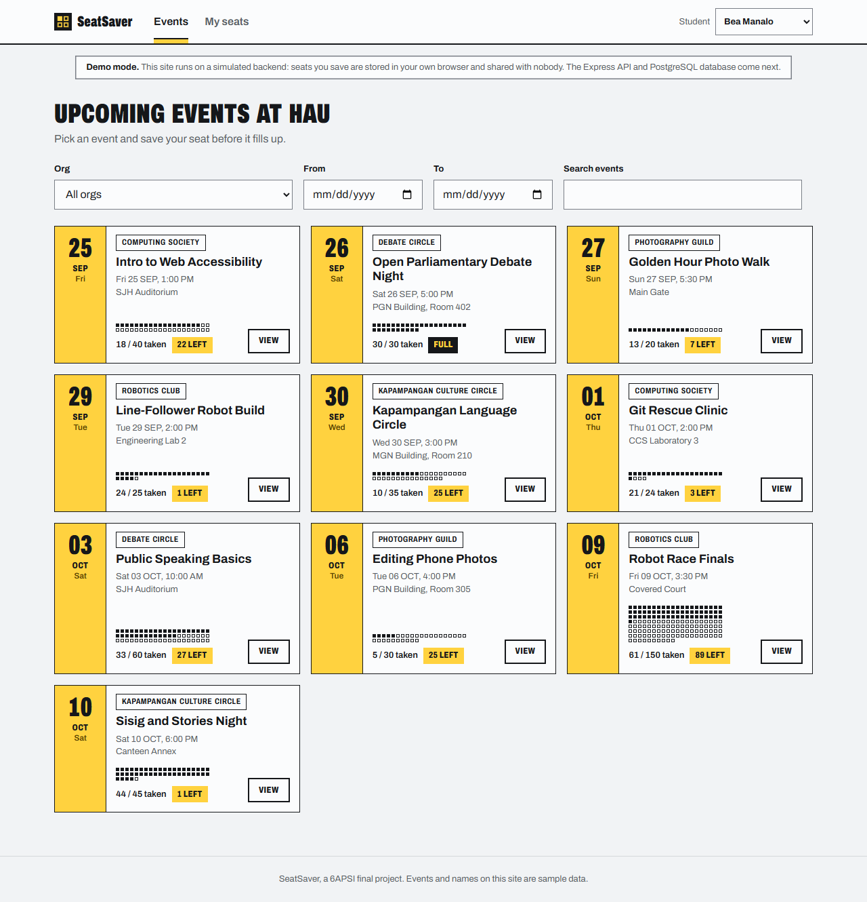
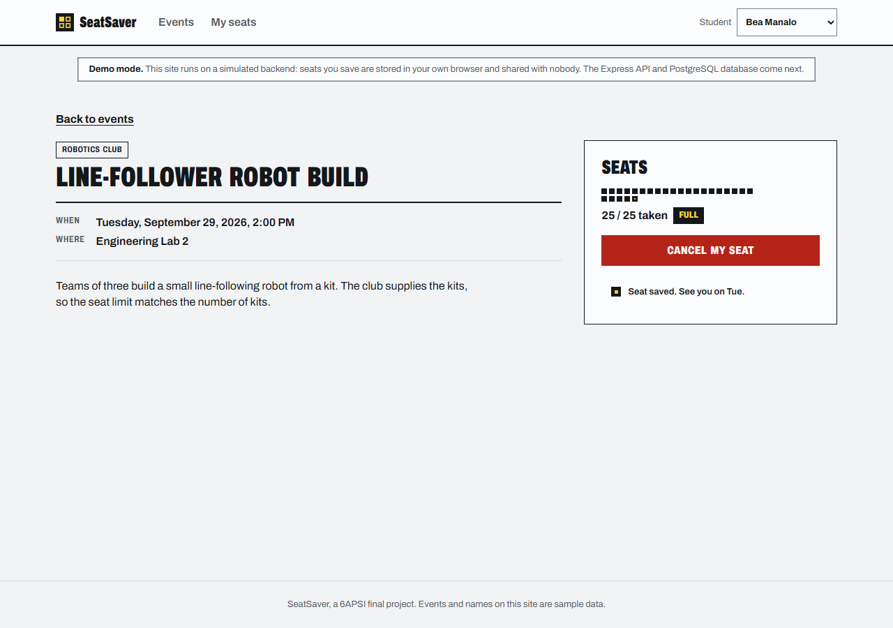
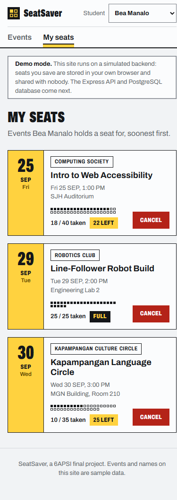

# SeatSaver

SeatSaver lets a student-org officer at Holy Angel University post an event with a fixed number of seats, and lets a student reserve one of those seats in a single tap. Organizers see the real headcount before the day instead of reconciling a Google Form with a Messenger poll.

**Live site:** https://trstnsnhn.github.io/Seatsaver/
**API:** planned for week 2, with a Neon PostgreSQL database
**Demo video:** coming in week 3

> **This deployment runs in demo mode.** You use the real interface while your browser simulates the backend, so the site works without a server. See [Demo mode](#demo-mode).

## Status

End of week 1 of 3. The React client runs the three student screens against a simulated backend. The Express API, the PostgreSQL schema, and the org dashboard come in week 2.

## What it does

**Working now, in demo mode:**

- **Events** lists events, soonest first, with an org filter, a date range, and a title search
- **Event detail** shows the venue, time, and a seat meter; **Save my seat** reserves a seat and **Cancel my seat** gives it back
- **My seats** lists the events the current student holds a seat for, with a cancel button on each
- A **student picker** in the header stands in for login: choose a seeded student, and all three screens switch to that student
- The seat limit and the one-seat-per-student rule both reject with `409 Conflict`, and a full event disables its button

**Planned for weeks 2 and 3:**

- An Express API and a PostgreSQL database on Neon, enforcing the same two rules in SQL
- An **Org dashboard** where officers create, edit, and delete events and see the attendee list
- A report of the most-reserved events

## Using it

1. Open the live site. The header starts on Bea Manalo.
2. Pick an event card and choose **View**. The seat meter shows one square per seat: solid squares are taken, outlines are open, and your seat has a yellow centre.
3. Choose **Save my seat**. The count goes up and the button changes to **Cancel my seat**.
4. Open **My seats** to see the events the selected student holds a seat for.
5. Switch to another student in the header and open the same event. If you took the last seat, you see a disabled **Event full** button.

The app stores everything you do in your browser's `localStorage` under `seatsaver:db:v1`. Clear site data to start again from the sample events.

## Running it yourself

**Requirements:** Node.js 20 or newer. The full stack will also need a PostgreSQL database (Neon from week 2).

**The client, in demo mode.** No database needed.

    git clone https://github.com/TrstnSnhn/Seatsaver.git
    cd Seatsaver/client
    npm install
    cp .env.example .env        # VITE_USE_MOCK_API stays true
    npm run dev                 # http://localhost:5173

You should see the Events screen with ten sample events and a demo-mode notice under the header.

**Tests.** The reservation rules have unit tests that need no browser and no database:

    cd client
    npm test                    # 4 tests, node:test

**Production build**, the same one GitHub Pages serves:

    cd client
    npm run build
    npm run preview             # http://localhost:4173

**The API.** `server/` holds the class template's sample API for now. I will add its setup steps with the SeatSaver API in week 2.

## Environment variables

Keep these out of git. Each folder's `.env.example` lists them with placeholder values.

| Name | Where | What it is |
| --- | --- | --- |
| `VITE_USE_MOCK_API` | client, at build time | only `false` turns demo mode off; unset means on |
| `VITE_API_BASE_URL` | client, at build time | the API's public URL, no trailing slash |
| `DATABASE_URL` | server | PostgreSQL connection string. Contains a password |
| `CORS_ORIGINS` | server | comma-separated origins allowed to call the API |
| `NODE_ENV` | server | `production` on the host |
| `PORT` | server | set by the host; do not set it yourself |

Vite copies each `VITE_` value into the built JavaScript, where anyone can read it. Never put a key, password, or connection string in one.

## Demo mode

The client runs two ways, chosen by `VITE_USE_MOCK_API` at build time.

| `VITE_USE_MOCK_API` | What happens |
| --- | --- |
| unset, or `true` | `client/src/api/mockApi.js` answers requests from `localStorage`, starting from `seed.json`. No server, no database, nothing shared between visitors |
| `false` | `client/src/api/httpApi.js` calls the Express API at `VITE_API_BASE_URL` |

Both files export the same seven functions, so switching to the live API needs no screen changes.

## API

`httpApi.js` calls these routes today. I will build them in the Express server in week 2.

| Method | Path | What it does |
| --- | --- | --- |
| `GET` | `/api/orgs` | list student orgs |
| `GET` | `/api/students` | list students for the picker |
| `GET` | `/api/events?org=&from=&to=&q=` | list events with seats taken, soonest first |
| `GET` | `/api/events/:id` | one event with its org and seats taken |
| `POST` | `/api/events/:id/rsvps` | reserve a seat, body `{ "studentId": "stu-1" }`; `201`, or `409` when full or already reserved |
| `DELETE` | `/api/events/:id/rsvps/:studentId` | cancel a reservation; `204`, or `404` when there is none |
| `GET` | `/api/students/:id/rsvps` | the events a student holds a seat for |

Planned with the org dashboard: `POST /api/orgs/:orgId/events`, `PATCH /api/events/:id`, `DELETE /api/events/:id`.

## Project structure

    client/
      src/api/           mockApi.js and httpApi.js (same functions), rules.js, seed.json
      src/pages/         EventsPage, EventDetailPage, MySeatsPage, NotFoundPage
      src/components/    Header, EventCard, SeatMeter, FilterBar, Button, StatusMessage
      src/context/       StudentContext: the selected student, shared across pages
      src/styles.css     design tokens as CSS custom properties
    server/              Express API (the class template's sample for now)
    docs/                planning documents, weekly reports, and screenshots in assets/

## Screenshots

**Event detail**, right after saving the last seat:

**My seats** on a 390px phone:

## Known issues and next steps

- Demo mode keeps reservations in one browser, so two visitors cannot compete for the same seat
- `server/` contains the template's sightings API; I write the SeatSaver schema and routes next
- I cannot test two simultaneous reservations for the last seat until PostgreSQL enforces the limit
- The header has no Manage link until I build the org dashboard

## Licence

MIT, see [LICENSE](LICENSE).
